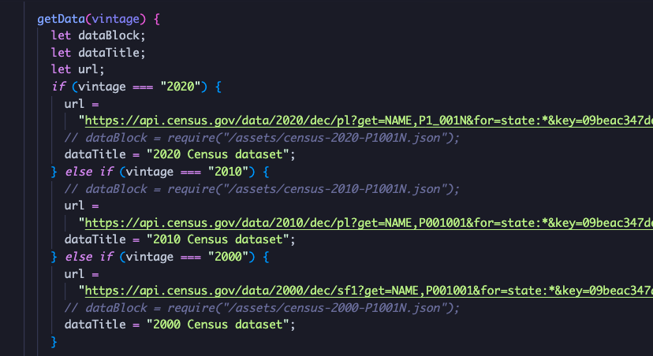

## Population Tracker

What is the spectrum of population density, spread across our country? How has this changed over time? Where have people migrated to, where are people building society?

Population Tracker seeks to answer these questions, and more. By fetching data from the census database for a range of years, PT displays an up-to-the-minute snapshot of the official numbers.

=

This app will create a simple graphical interface to display population data in the United States. Data is sourced via US Census Bureau (census.gov).

Initial presentation of data is current population by state and region. The viewer can change which data is displayed by changing a few parameters, including what year the data is from, and related data points such as age.

## Functionality and MVPs

In Population Tracker, users are able to:

- Choose which year of census data to populate map


When year is selected, PT will fetch live U.S. Census Data.




```
{
  "firstName": "John",
  "lastName": "Smith",
  "age": 25
}
```

A list of states and territories appears. It can be sorted either by name or by population.


- See census data populated on a U.S. map
- Adjust year, age, ethnicity, country of origin
- View sample data group renderings
- View data as change over time, or by year

In addition, this project will include:

- An **about** modal giving simple instructions for use, and explanation of relevance
- A production README

## Wireframe


- Nav links include the projects Github repo, my LinkedIn, and the About modal
- On the right side, options selectors will allow the user to filter results by year, age, median income and country of origin
- Also on the right, there will be links to display pre-selected data sets

## Technologies, Libraries, APIs

This project will be implemented with the following technologies:

- D3.js to render map and data
- Webpack to bundle and transpile JavaScript code
- npm to manage project dependencies

## Implementation Timeline

- Friday afternoon and Weekend: Setup project, get webpack up and running. Make sample queries to obtain data points for mapping. Lock down first draft data set and functionality to process fetched data into data points suitable for rendering on U.S. map.
- Monday: Create basic U.S. map rendering, determine key data points. Create alternate state, and alternate rendering. Build UI to toggle between them.
- Tuesday: Lock down decisions on final data sets (which census years) and options sets (age, nationality, ...). Outline and begin implementing final blueprint.
- Wednesday: Complete basic product. Debug and clean up.
- Thursday Morning: Deploy to GitHub pages. Rewrite this as a production README.
